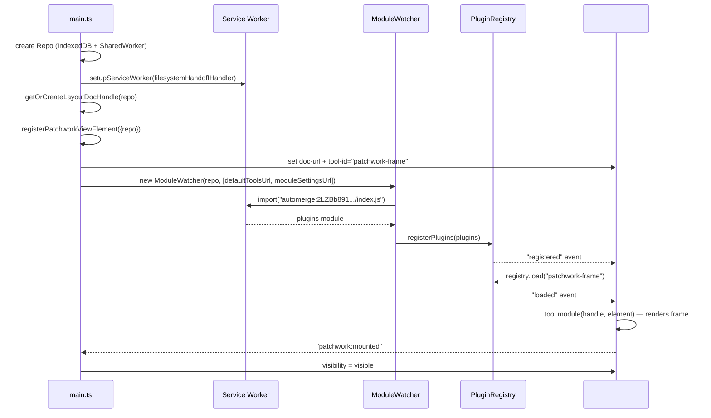

# Tiny Patchwork

**Source:** `sites/tiny-patchwork/`

Tiny Patchwork is the host application. Its entire visible UI is rendered by a single `<patchwork-view id="root">` element — the app itself only bootstraps the infrastructure (repo, service worker, module watcher) and points that element at the user's account document.

## The layout document

Every user has a **layout document** (`TinyPatchworkLayoutDoc`) stored in an Automerge document whose URL is persisted in `localStorage`. It acts as the user's configuration and the root of their document library:

```ts
type TinyPatchworkLayoutDoc = {
  // sub-document URLs
  contactUrl: AutomergeUrl;       // user's identity (name, color, avatar)
  rootFolderUrl: AutomergeUrl;    // root FolderDoc of the document library
  moduleSettingsUrl: AutomergeUrl; // ModuleSettingsDoc with installed plugin URLs

  // tool IDs for the frame
  frameToolId: string;            // default: "patchwork-frame"
  accountSidebarToolId: string;   // default: "chee/sideboard"
  contextSidebarToolId: string;   // default: "context-sidebar"
  contextToolIds: string[];       // default: ["comments-view", "history-view", "context-view"]
  documentToolbarToolIds: string[]; // default: ["document-title", "back-link-button", ...]
};
```

On first run, `createLayoutDoc` creates three sub-documents and stores their URLs:

1. **Contact doc** (`patchwork:contact`) — the user's anonymous identity with a color for presence indicators
2. **Root folder doc** (`folder`) — an empty `FolderDoc` that becomes the root of the document tree
3. **Module settings doc** (`patchwork:module-settings`) — a `ModuleSettingsDoc` with an empty `modules` array

The layout doc URL is stored in `localStorage` under `"tinyPatchworkAccountUrl"`. On subsequent loads, the app reads the existing URL and validates it; if it is malformed or outdated (a schema migration), it creates a new layout doc while preserving the existing `contactUrl`, `rootFolderUrl`, and `moduleSettingsUrl`.

## Bootstrapping sequence



1. A `Repo` is created with `IndexedDBStorageAdapter` (local persistence) and a `MessageChannelNetworkAdapter` connecting to the `SharedWorker`. If the SharedWorker cannot be created, a direct `WebSocketClientAdapter` to `wss://sync3.automerge.org` is used as a fallback.
2. `setupServiceWorker(createFilesystemHandoffHandler(repo))` registers the Service Worker and wires the handoff.
3. `getOrCreateLayoutDocHandle(repo)` loads or creates the layout document.
4. `registerPatchworkViewElement({repo})` defines the `<patchwork-view>` custom element.
5. The `#root` element is given `doc-url` (the layout doc URL) and `tool-id="patchwork-frame"` (or a custom frame from the `?frame=` URL parameter).
6. A `ModuleWatcher` is started watching both the default tools URL and the user's `moduleSettingsUrl`. When modules load, `registerPlugins(mod.plugins, importUrl)` is called.
7. The `#root` element is kept invisible (`visibility: hidden`) until the first `patchwork:mounted` event fires from the root element itself, preventing a flash of unstyled content. A 12-second timeout makes it visible anyway as a failsafe.

## The SharedWorker

`automerge-worker.ts` runs as a `SharedWorker` — one instance shared across all browser tabs. It:

- Creates its own `Repo` backed by `IndexedDBStorageAdapter` and a `WebSocketClientAdapter` to `wss://sync3.automerge.org`
- Accepts `connect` events from each tab and adds a `MessageChannelNetworkAdapter` per port
- Only syncs with peers whose peer ID starts with `"storage-server-"` (the WebSocket server), keeping tab-to-tab traffic local
- Forwards all console output to the main thread via `BroadcastChannel("automerge-worker-logs")` since SharedWorker console output is not always visible in DevTools
- Listens on `BroadcastChannel("automerge-worker-delete")` so any tab can request document deletion from the shared store

The main tab's `Repo` uses a `sharePolicy` that only shares with peers whose ID contains `"shared-worker"`, so documents never sync directly from tab to remote — they always go through the SharedWorker.

## URL-based routing

Navigation is driven by the URL hash. The `#root` `<patchwork-view>` element always renders the frame; the frame responds to `patchwork:open-document` events internally to update the selected document. The host app reflects the selection in the URL hash so it survives page refreshes and can be shared as a link.

Two hash formats are supported:

**Legacy format** (from original Patchwork):
```
#Title--<documentId>
```
Example: `#My-Document--2c4E6m5u6rPWkeDxA6i1YWrAjTzD`

**Current format:**
```
#doc=<documentId>&tool=<toolId>&heads=<h1|h2|...>&title=<title>&type=<type>
```

On `hashchange`, `handleHashChange` parses the current hash and dispatches a `patchwork:open-document` event on the root element, which the frame intercepts.

Conversely, when the frame dispatches `patchwork:open-document` (navigation triggered from within the UI), the host app serializes the target URL into the hash via `history.pushState`-equivalent hash update.

### `?frame=` override

The URL parameter `?frame=<toolId>` overrides `frameToolId` on startup, rendering a completely different top-level tool instead of the standard patchwork frame. Useful for embedding Patchwork with a custom shell.

## Change attribution

`monkey-patch-doc-handle.ts` patches `DocHandle.prototype.change` and `DocHandle.prototype.changeAt` to inject `time` (current timestamp) and `message: JSON.stringify({ author: contactUrl })` into every Automerge change. This metadata is stored in the Automerge change headers and enables the history view to show who made each change and when. It is noted in the code as a temporary measure until Automerge natively supports richer change metadata in a more storage-efficient way.
