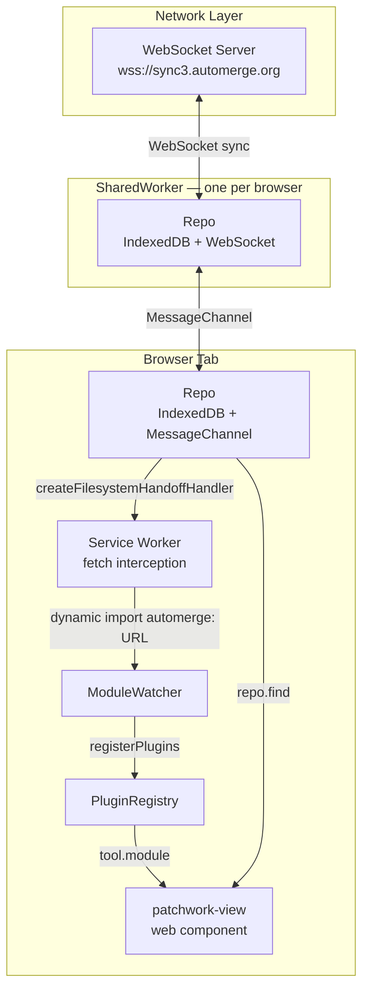
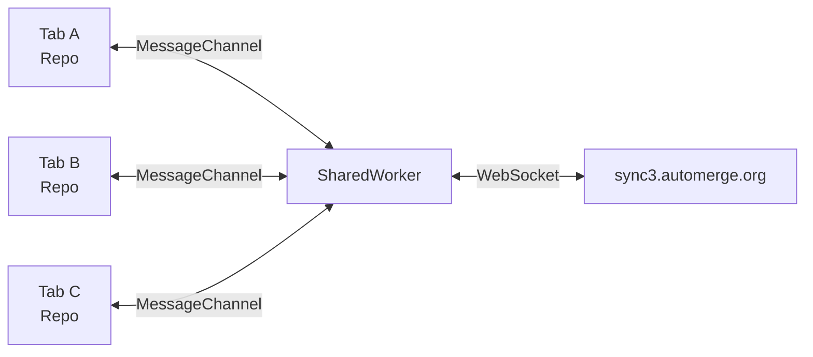
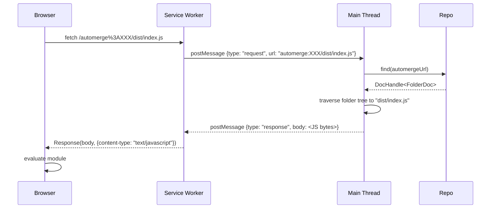
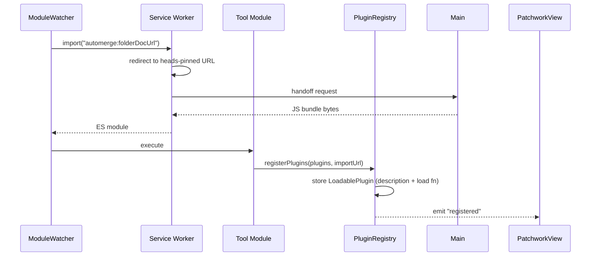
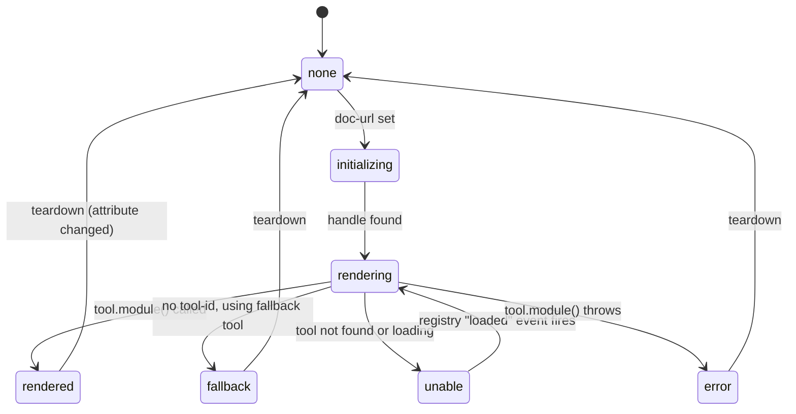

# Architecture

## System overview



## Network topology

The system uses a three-tier architecture to keep network connections centralized:

1. **Tab** — each browser tab has its own `Repo` backed by IndexedDB. It only syncs with peers that have `"shared-worker"` in their peer ID (i.e., the SharedWorker). It never opens a WebSocket directly.
2. **SharedWorker** — a single `SharedWorker` runs across all tabs in the same browser. It holds the WebSocket connection to `wss://sync3.automerge.org` and accepts `MessageChannelNetworkAdapter` connections from each tab. All cross-tab and cross-device sync flows through here.
3. **WebSocket server** — the remote sync server, used for persistence and cross-device sync.

If the SharedWorker cannot be created (e.g. in an environment that doesn't support it), the tab falls back to opening a direct WebSocket connection.



## Service Worker handoff protocol

Tool modules are stored as Automerge folder documents, not on a regular HTTP server. To serve them via standard `import()` calls, a Service Worker intercepts all same-origin requests for URL-encoded paths like `/automerge%3A2LZBb...%23abc123/dist/index.js`.

When such a request arrives, the SW cannot access the Automerge repo directly (it runs in a separate global). Instead it **delegates** the request back to the main thread via `postMessage`, awaiting a response before resolving the `FetchEvent`. This is the "handoff":



URL-pinned requests (containing a `#heads` component) are served cache-first — the same module at the same content-addressed heads will never change, so it is safe to cache forever. Requests without heads are redirected (307) to the current heads, ensuring the client always fetches a cacheable URL.

## Module loading and plugin registration



Modules call `registerPlugins` on import, which stores each plugin as a **description + `load()` function** pair. The implementation code is not fetched until a `<patchwork-view>` actually needs to render that tool.

## Document rendering lifecycle



The `<patchwork-view>` element:

1. Receives `doc-url` (and optional `tool-id`) as HTML attributes
2. Calls `repo.find(docUrl)` to get the live `DocHandle`
3. Looks up the tool in the `"patchwork:tool"` registry — using `tool-id` if provided, otherwise falling back to the best matching tool for the doc's `@patchwork.type`
4. If the tool is only registered (description known but module not loaded), triggers `registry.load(toolId)` and shows a spinner
5. Once loaded, calls `tool.module(handle, element)` and stores the returned cleanup function
6. Emits `patchwork:mounted`

If no matching tool is found, `<patchwork-view>` emits `patchwork:no-tool`. The host app listens for this and asks `ModuleWatcher` to load the `suggestedImportUrl` from the document's `@patchwork` metadata. If that module registers a matching tool, the `"loaded"` event fires and the element re-renders automatically.

## Hot-reload

The `pushwork` CLI syncs a built tool bundle into an Automerge folder document and bumps `FolderDoc.lastSyncAt`. `ModuleWatcher` watches each folder doc for this field changing and re-imports the module at the new version-pinned URL (the current heads). The freshly-imported module calls `registerPlugins` again, this time with an updated `importUrl`. Any `<patchwork-view>` that was already rendering that tool sees the new `importUrl` differ from the cached one, tears down, and re-renders with the new code — no page reload required.

## Document creation

When a new document is created, `createDocOfDatatype2` is typically used:

```ts
const handle = await repo.create2();
handle.change(doc => {
  datatype.module.init(doc, repo);
  doc["@patchwork"] = {
    type: datatype.id,
    suggestedImportUrl: datatype.importUrl,
  };
});
```

The `suggestedImportUrl` is set to the same automerge URL the datatype module was loaded from, so a document always carries a pointer back to the tool that can render it — even in a fresh session where no modules have been loaded yet.
