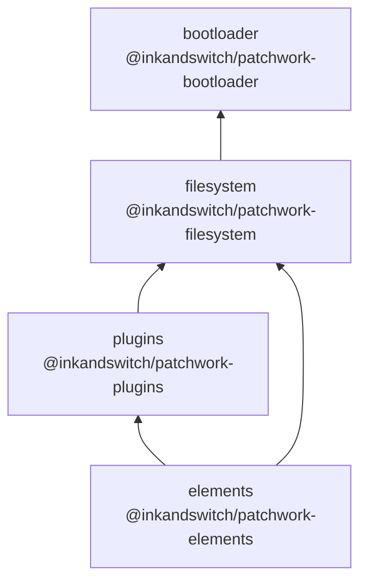

# Core packages

The `core/` directory contains four packages that form the foundational layer of Patchwork. Every tool, app, and shared library builds on top of these.

```
core/
├── bootloader/   @inkandswitch/patchwork-bootloader
├── filesystem/   @inkandswitch/patchwork-filesystem
├── plugins/      @inkandswitch/patchwork-plugins
└── elements/     @inkandswitch/patchwork-elements
```

## Dependency order

The packages layer cleanly from lowest-level to highest:



- **bootloader** has no dependencies on the other core packages. It defines the Service Worker and the `HandoffHandler` type.
- **filesystem** depends on bootloader only for the `HandoffHandler` type. It provides the virtual filesystem and module loading logic.
- **plugins** depends on filesystem for `HasPatchworkMetadata` and `getType`. It provides the plugin registry.
- **elements** depends on both plugins (for tool resolution) and filesystem (for metadata helpers). It provides the `<patchwork-view>` web component.

## Package summaries

### `bootloader` — [deep dive](./bootloader.md)

Manages the Service Worker lifecycle and injects an import map so tool modules served from Automerge documents are importable via standard `import()`. The Service Worker intercepts `automerge:` URL requests and uses a **handoff** protocol to delegate them to the main thread, which has access to the Automerge repo.

Key exports: `setupServiceWorker(handler)`, the `HandoffHandler` type, Vite plugins.

### `filesystem` — [deep dive](./filesystem.md)

Defines the data model for the virtual filesystem (`FolderDoc`, `DocLink`, `UnixFileEntry`) and the `HasPatchworkMetadata` contract that all Patchwork documents must fulfill. Provides `createFilesystemHandoffHandler` (the main-thread side of the Service Worker handoff) and `ModuleWatcher` (live-reloading module importer).

Key exports: `createFilesystemHandoffHandler`, `ModuleWatcher`, `FolderDoc`, `HasPatchworkMetadata`, `getType`, `getSuggestedImportUrl`.

### `plugins` — [deep dive](./plugins.md)

A typed, event-driven plugin registry. Manages **datatypes** (document schemas) and **tools** (UI renderers) with lazy-loading. Plugins are registered as a description plus a `load()` function; the implementation is only fetched when a document actually needs to be rendered.

Key exports: `PluginRegistry`, `registerPlugins`, `getRegistry`, `getSupportedTools`, `getFallbackTool`, `ToolDescription`, `DatatypeDescription`, `ToolImplementation`.

### `elements` — [deep dive](./elements.md)

Provides the `<patchwork-view>` custom element — the universal rendering primitive. Given a `doc-url` attribute, it resolves the document, finds or falls back to the right tool, triggers lazy-loading if needed, and calls `tool.module(handle, element)`.

Key exports: `registerPatchworkViewElement`, `openDocument`, custom events `patchwork:open-document` / `patchwork:mounted` / `patchwork:no-tool`.
