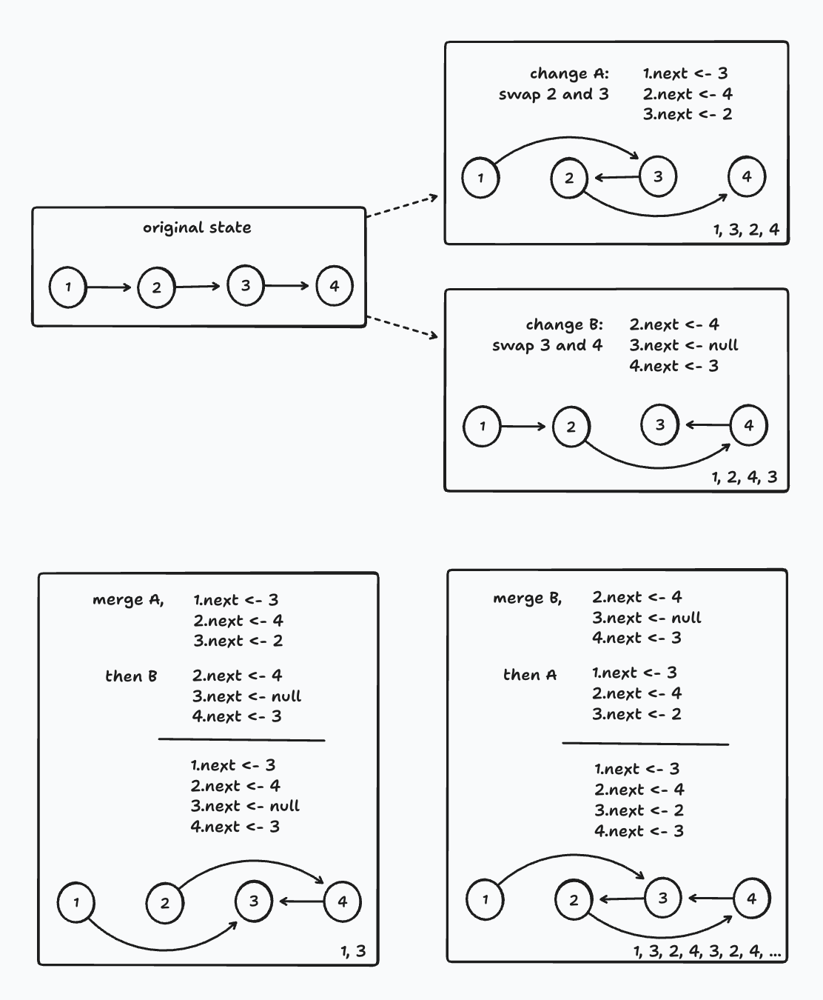

# Convergence Is Not Enough

## Introduction

In the _Livelymerge_ project, Dan Ingalls and I (Alex Warth) are building a Lively Kernel-like system whose heap — every object, class, and method — is an Automerge document. The pitch, from the first note in this series, was that this would give us merges "for free": multiple users share the same object memory, work on it concurrently (even offline), and Automerge reconciles everything.

I also wrote that merging the state of a live system is a nontrivial problem, and that there's no way to guarantee that objects' invariants won't be violated. This note looks that problem straight in the eye, with a concrete example. We don't have a solution — this is an acknowledgment, not a victory lap — but I'll sketch the directions we're thinking about, and I'd love to hear yours.

## Exhibit A: a linked list

Automerge's promise is _convergence_: after two clients exchange their changes, they are guaranteed to arrive at the same state. Note what's missing from that sentence: nothing says the state they agree on is one your program can live with. To be fair, for lots of applications — documents, todo lists, sketches — Automerge's merge does just what you'd want. But in LM we're doing something weirder: asking it to merge the heap of a running program, pointers and all. That's well outside Automerge's comfort zone, and this note is about what happens out there.

Consider a humble linked list containing 1 → 2 → 3 → 4, built the way any programmer would build it in LM: each node has a `next` property that points to another node. Now suppose two clients modify it concurrently:

- **Client A swaps 2 and 3**, by writing `1.next ← 3`, `2.next ← 4`, and `3.next ← 2`. Their list now reads 1, 3, 2, 4.
- **Client B swaps 3 and 4**, by writing `2.next ← 4`, `3.next ← null`, and `4.next ← 3`. Their list reads 1, 2, 4, 3.

Now let's see what happens when these changes sync. Here's how Automerge merges them: each client's change is a _transaction_, and the merge behaves as if one transaction's writes were applied and then the other's — Automerge deterministically picks one of the two orders, and both clients get the same one. (So arbitrary interleavings of the individual writes are not possible, which limits the number of states we can end up in.) A write that the later transaction didn't touch survives from the earlier one; where both transactions wrote, the later one wins.

But look at what the two possible orders actually produce. `1.next` comes from A either way (B never wrote it), `4.next` comes from B either way, and `3.next` — which both transactions wrote — goes to whichever came second:

- **A then B** (`3.next = null`): traversing from 1 yields **"1, 3" — the list has been truncated**, and nodes 2 and 4 are stranded off to the side.
- **B then A** (`3.next = 2`): traversing from 1 yields **"1, 3, 2, 4, 3, 2, 4, ..." — the list now contains a cycle**, and any code that walks it will never terminate.

Let me emphasize: Automerge did nothing wrong here. Both clients converge on the same result, deterministically, exactly as promised. The trouble is that replaying B's _writes_ after A's is not the same as performing B's _intent_ after A's. Client B computed those three writes by looking at the original list, 1 → 2 → 3 → 4 — a state that, post-merge, no longer exists. If B's "swap 3 and 4" had actually _run_ after A's change, it would have produced different writes and a perfectly good list. The merge replays effects, not intents, and the programmer's invariants — every node appears exactly once, no cycles, the list ends — were never written down anywhere that Automerge could see. Convergence is not enough.

## This is not just about linked lists

You can dodge this particular example by not building linked lists out of `next` pointers. Automerge has built-in datatypes with well-behaved merge semantics — its arrays (which our object model exposes directly) merge concurrent insertions and deletions the way you'd hope, and maps of various flavors are easy to represent. We lean on this hard in practice in Morphic, the graphical framework at the heart of our system. (Morphic originated in the Self programming language — see [Maloney et al.](https://dl.acm.org/doi/10.1145/215585.215636) — and was later used in Squeak and Dan's Lively Kernel. In Morphic, everything you see on screen is a _morph_: an object that can contain other morphs, all the way down to buttons and text.) Each morph's `submorphs` list is an Automerge array, and concurrent adds from two users interleave just fine.

But all bets are off when you _compose_ these datatypes — and this sort of thing happens very often in programming! The merge orders whole transactions, but it still replays their writes blindly, so any invariant that spans more than one property or object is invisible to it:

- A doubly-linked list (`next` and `prev` must mirror each other).
- A tree (Morphic itself: every morph's `owner` must agree with its owner's `submorphs` — two users concurrently reparenting the same morph can break this today).
- A cached count or index that must agree with the collection it summarizes.
- An "each element appears exactly once" constraint on anything.

In a system like LM — where the heap **is** the document, and users are encouraged to build whatever data structures they like — this isn't a corner case. It's a problem we're actively thinking about.

That said, it has bitten us less often than we anticipated. With some careful programming — leaning on Automerge's built-in datatypes wherever possible, and avoiding redundant representations that can be made to disagree — we've been able to build a system that holds up well in day-to-day multi-user use. (Careful programming isn't a _solution_, of course; it's what you do while you're waiting for one.)

## A direction we like: merge-aware datatypes

Today, merging happens at the level of the raw object graph, below the abstractions the programmer actually cares about. Given the diagnosis above, the natural move is to merge the _intents_ instead of the writes they compiled down to. And notice that the intent isn't "set `3.next` to null" — it isn't even "swap 3 and 4", which is still implementation, just one level up. The intent is what the programmer would say at the level of the abstract type: "remove this value from the list", "insert this value after that one".

Automerge already works exactly this way — but only for its built-in types. A change to an Automerge list is recorded in the document's history as insert and delete _operations_ (that's the actual Automerge term), not as pointer writes, and that's precisely why concurrent edits to those lists merge so well. So here's an idea we find intriguing: what if Automerge exposed a notion of _types_ — list-like, map-like, counter-like — that programmer-defined data structures could declare themselves to be? The representation inside the document would be up to the programmer, but reads and writes would go through the type's interface, and what gets recorded as operations would be the type's higher-level vocabulary. Merging would then mean merging _those_ operations, with semantics defined once per type. Even better if programmers could define entirely new types, not just adopt the built-in ones. There's encouraging precedent that this can be done rigorously for a nontrivial type: Kleppmann et al.'s [move operation for replicated trees](https://martin.kleppmann.com/papers/move-op.pdf) bakes "reparenting never creates a cycle" directly into the merge. The hard open question for user-defined types is the convergence obligation — a type's operations have to commute, or come with a deterministic way to resolve the cases where they don't, and it's not obvious how a system would help programmers meet (or even check) that bar.

We're not the only ones circling this territory: Martin Kleppmann and Vincent Liu are actively working on a related problem — as I understand it, they frame it as supporting _constraints_ on a document. As far as I know they haven't written it up yet, but Martin's [Convergence](https://queue.acm.org/detail.cfm?id=3546931) reading list is a good entry point to the connection between invariants and coordination. If you've thought about this problem — or you're sitting on a better direction — let's talk!

## Next time

In the next note, we'll describe the object model that makes all of this concrete: how we make an Automerge document look and feel like an ordinary JavaScript heap — object table, proxies, garbage collection and all.
