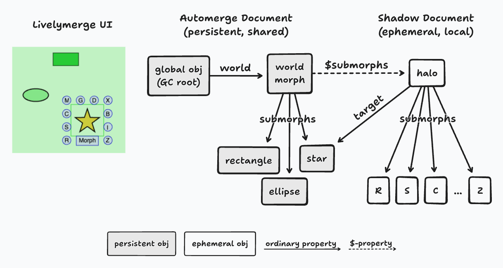

# Local State in Livelymerge

## Introduction

In the _Livelymerge_ project, Dan Ingalls, Peter van Hardenberg, and I (Alex Warth) are building a Lively Kernel-like system whose heap is an Automerge document. (See my previous lab note for the details of our object model.) The whole point of this arrangement is that every object is persistent and shared: if you and I are looking at the same document, we're looking at the same objects, and they'll still be there two weeks from now.

It didn't take much multi-user testing to discover that sometimes, this is not what you want.

Here's the example that forced the issue. In Morphic, you cmd-click a morph to summon its _halo_ — a ring of handles for moving, copying, resizing, etc. A halo is a morph like any other, so in our system it was a persistent, shared object. Which meant: when I cmd-clicked a rectangle, my halo popped up **on your screen**. And if I closed my laptop without dismissing it, it would still be there — for both of us — two weeks later.

The halo is _my_ UI, part of _my_ session. So are my keyboard focus, the hover affordances under my pointer, and the animations I've started. None of this belongs in the document.

We call this **local state**: state that exists on just one machine, for just one session — it's fine (desirable, even) for it to vanish on reload.

Supporting local state is trickier than it sounds. Here's why: everything that happens in LM — handling a pointer event, redrawing the screen — runs inside a short-lived _transaction_ on the Automerge document (a single call to `change`; there's one per frame). At the end of each transaction, the system garbage-collects any newly-created objects that didn't end up in the heap. So a halo can't just live in a temporary variable — it would be swept away at the end of the frame in which it was created. It has to survive from one transaction to the next, and until now, the only home we had for an object like that was the shared, persistent heap. (For a while we worked around this by stashing things on `window`, the JS global object. That "worked", but it was a hack — that state was invisible to our object model, and it caused the kind of bugs you'd expect.)

## Introducing `$`-properties

The mechanism we landed on is small enough to state in one line: **a property whose name begins with `$` is local.** Local properties are per-replica, they survive across transactions, but they're gone after a reload. Everything else about the object model is unchanged.

```
const morph = {
  owner: someMorph,        // shared, persistent property
  submorphs: [a, b],       // shared, persistent property
  $submorphs: [haloMorph], // local, ephemeral property
};
```

Note that it's the _property_ that is local, not the object it refers to. This turns out to be the key design decision, as we'll see below.

## What we use them for

Some real examples from our Morphic implementation.

**Halos.** Every morph carries two submorph lists: `submorphs` (persistent, shared) and `$submorphs` (mine alone). Halos attach via the latter — here's `showHalo`, straight from our implementation (note that a halo is a submorph of the _world_, not of its target):

```
showHalo() {
  this.world().removeExistingHalos();
  // Per-user UI: halos never enter the Automerge document.
  this.world().addEphemeralMorph(new HaloMorph(this));
}
```

where `addEphemeralMorph` is just:

```
addEphemeralMorph(morph) {
  this.ephemeralSubmorphs().push(morph);
  morph.owner = this;
  ...
}

ephemeralSubmorphs() {
  if (!this.$submorphs) this.$submorphs = [];
  return this.$submorphs;
}
```

That lazy initialization (`if (!this.$submorphs) ...`) may look like a silly optimization, but it's actually necessary. Our first instinct was to have the constructor create that array — but a constructor runs exactly once, on the replica where the morph was created, whereas local state is per-replica _and_ per-session. A morph that comes back from the document after a reload, or that arrives from a collaborator via sync, never ran its constructor here — and, by design, it shows up with no `$`-properties at all. So `$`-structure can't be established at construction time: it has to be created on demand, like this, or by a session-start initializer (more on those below).

Rendering and hit-testing treat the two lists uniformly: a morph's submorphs — persistent and ephemeral alike — are merged into a single stacking order, and being local has no bearing on where a morph stacks. (Halos do sit above everything, but that's an always-on-top flag, not a consequence of being local.) And here's the economy of making the _property_ local rather than the object: only the _attachment_ is local. The halo's own subtree — its handles, their shapes, their labels — is made of perfectly ordinary objects, connected by perfectly ordinary properties. They stay local anyway, because the only way to reach them is through that one `$`-property.

**The stepping schedule.** `Morph`'s `startStepping` registers a step method to be called periodically — it's how you implement animations, simulations, and other autonomous behaviors. Who should run these steps in a multi-user system? If the schedule were shared, _every_ replica would run _every_ step — side effects times N users. (This is the "who runs the processes?" consistency question from the previous note, showing up in practice.) So the schedule is local:

```
startStepping(method, argIfAny, msTime) {
  this.stopStepping(method);
  const spec = new StepSpec(this, method, argIfAny, msTime);
  this.steppingSpecs().push(spec); // lazily-created, à la ephemeralSubmorphs
  this.world().startSteppingSpec(spec); // adds to the world's $stepList
}
```

Only the replica that called `startStepping` runs the step methods — everyone else sees the results through the document. Keeping the schedule local also keeps its churn out of the document: each spec's `nextStepTime` is rewritten on every tick, but since the specs live behind a `$`-property, those writes never become Automerge operations.

**Per-session UI state.** Assigning to a `$`-name at the top level creates a local property _of the global object_ — a per-user global. We use one to root the session's UI state:

```
$uiState = {
  eventListeners: [],       // keeps browser-held closures alive across transactions
  longClickByPointerId: {},
  pointerLocation: null,
  ...
};
```

`$uiState` is re-created by `initUI()` at the start of every session, which is exactly the lifetime it should have. The world's `$keyboardFocus` and `$pointerFocus` work the same way.

## The mechanism



Recall from the previous note that freshly-created objects don't go straight into the Automerge document: they live in a local _shadow document_, and at the end of each transaction the GC _promotes_ the ones that have become reachable from the root. Local state turned out to be a small extension of that same machinery. The whole design reduces to one rule:

> **An object is persistent iff it is reachable from the persistent root without passing through a `$`-property.**

The GC's traversal is blind to `$`-properties — their values are stored in a sidecar (`objectId × propertyName → value`), never in the heap entries it walks, so they can't leak into the Automerge document even by accident. At the end of each transaction, every shadow object is classified as one of:

- **Promote** — reachable from the root through ordinary properties only: it graduates into the Automerge document (persistent from now on — promotion is one-way, and it's transitive: promoting an object promotes everything it references through ordinary properties).
- **Retain** — not persistently reachable, but reachable from someone's `$`-properties: it stays in the shadow document. (E.g., a halo between frames.)
- **Collect** — reachable from neither: reclaimed.

One implementation detail worth calling out: object ids are shared across the document and the shadow document, and promotion preserves them. So when an object is promoted, references never need rewriting, proxies remain valid, and — conveniently — it _keeps its local properties_. (Indeed, the world itself is a shared, persistent morph and my halo hangs off its `$submorphs`.)

## Gotchas

- **The programmer must be careful to avoid accidentally promoting ephemeral objects.** If a _persistent object_ references your local, ephemeral morph via an ordinary (non-`$`) property, the next GC will dutifully promote it into the shared document. (Ordinary references _between_ ephemeral objects are fine — that's the halo's subtree, above. What matters is whether the referrer is persistently reachable.) This bit us early on: the world's `pointerFocus` property (which may reference a halo handle mid-drag) had to become `$pointerFocus`, or halos leaked into the document one drag at a time.
- **Local state doesn't survive a reload** — that's by design, but it means anything rooted in `$`-properties must be initialized lazily (like `ephemeralSubmorphs()` above) or at the start of a session (via `initUI()`).
- Writes to `$`-properties are **non-transactional**: they take effect immediately and don't roll back if the enclosing transaction fails. We haven't been bitten by this yet, but it's something we're keeping an eye on.

## Coming Up

There's a third category of state hiding in this design: a user's _hand_ — the Morphic object that represents their cursor — should be **visible to others but persisted by no one**. You want to see where I'm pointing, but nobody needs my hand fossilized in the document after I leave. We've built a mechanism for this shared-but-ephemeral state (local state turned out to be half of the solution), and it deserves a note of its own.

Next up, though: **performance**. Everything in LM — every morph, class, method, and variable captured by a closure — lives in an Automerge document. And our own object model makes that expensive: a single property read in LM fans out into several reads from the document — a lookup in the object table, the object's serialized state, any references that need chasing — and a running program does this millions of times per second, against a data structure built for merge and sync, not for use as a program's working memory. Can a system built this way run fast enough for authentic use? For a while the honest answer was no. The next note is about the optimizations that changed that.
